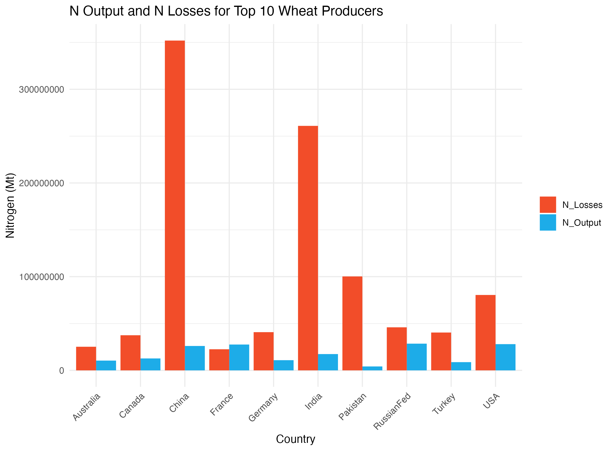
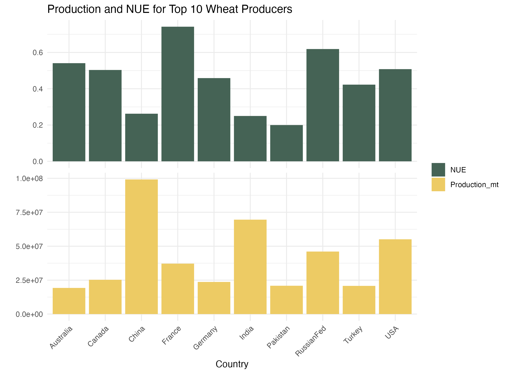

## Dependencies

install.package("raster")\
install.package("exactextractr")\
install.package("tidyverse")\

## Running the code

-   Please install the necessary packages mentioned above.
-   Create a folder called 'images' inside your working directory.
-   Create a folder called 'data' inside your working directory.
-   Inside the folder data, create a new folder called 'input'.
-   Unzip the provided data (i.e., SPAM_2005_v3.2, NUE_Zhang_et_al_2015, GAUL), into the 'input' folder.
-   Inside the folder data, create a folder called 'output'.

The main code can be found on the main.R file. All output files will be saved into the 'data/output' folder.

## Question 4

The top 10 producers are in order:

1.  China
2.  India
3.  USA
4.  Russia
5.  France
6.  Canada
7.  Germany
8.  Pakistan
9.  Turkey
10. Australia

 

Despite further analysis (e.g., Comparative Statistics, Predictive Models) being important for a better understanding of any patterns, we can observe the following. The 3 biggest wheat producers (i.e., China, India, USA) are as well the ones with the highest Nitrogen Losses. However, the USA, is able to compensate by having a higher NUE than its counterparts. A descriptive/visual analysis shows that higher production volumes does not necessarily relate in a lower NUE as it is seen in the case of Pakistan.

## Question 5

The analysis performed in 4, allows to explore the environmental impacts of agriculture in the top 10 wheat producers, specifically to Nitrogen dynamics. These insights could be used to improve the predictive power of the BNR's modelling suite. However, it is important as well to assure good data quality, as well as proper data bias testing. Additionally, the models must be sensitive to regional dynamics, in contrast to country level dynamics, as it will assure a better predictive value to the models.
